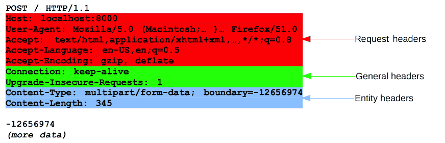

## Intro on HTTP Messages
HTTP messages are how a server and a client can communicate data with each other on the web. A server is a remote computer providing data, while a client is a local computer requesting data from the server. 

There are two types of HTTP messages, requests and responses. A request is sent by the client to either send or retrieve data to or from the server. A response is the reply from the server, in response to a request. These two types of messages are made up of ASCII text and can have multiple lines of text.

## HTTP Message Structure
Head:
1. Start-line: Describes the request to be made or the status of the response
2. Headers: Specify the request or describes details about the body of the message
3. Blank line to indicate the end of the above metadata

Payload:
1. Optional body containing data associated with the request or response

`Image source: https://developer.mozilla.org/en-US/docs/Web/HTTP/Messages`

## HTTP Requests
HTTP requests are messages sent by the client to either send data or retrieve data from a server.

### Start-line
The start-line (first line) in the request contains the following three elements:
1. HTTP method such as GET or POST that describes the action to be performed
    - GET method retrieves data from a server
    - POST method sends data to a server accompanied by a payload
2. Request target which is usually a URL
3. HTTP version which defines which version of HTTP to use

### Headers
There are 3 groups of headers.
1. General headers which apply to the whole HTTP message.
2. Request headers which modify the request itself.
3. Entity headers which apply to the body only. 

### Body
The last part of the request is the body. Not all requests are required to have a body, but a body is required for requests using the POST method. It is used to indicate what data is being sent. There are two types of bodies. The first type of body is single-resource bodies, which consist of one single file. The second type of body is multiple-resource bodies, which consist of multiple parts.

### Example of a HTTP request

`Image source: https://developer.mozilla.org/en-US/docs/Web/HTTP/Messages)`

## HTTP Request Test using Discord Webhooks
Now that you're familiar with how HTTP requests and responses work, let's do a quick demo using curl and Discord webhooks. The curl command allows you to transfer data from or to a server. Discord webhooks allow you to receive data from a request and displays that data into your Discord channel.

### Create a Discord Webhook
1. In your Discord server, click on the Edit Channel icon on the channel that you want to create your webhook in.
2. Click on Integrations.
3. Click on View Webhooks.
4. Click on New Webhook.
5. Click on Copy Webhook URL. Save this URL somewhere, we will be using it later to send a request.

### Using the curl command
1. Open your terminal and enter this:  
`curl -X POST -H "Content-Type: application/json" -d '{"username": "Testing the Webhook", "content": "hello world"}' "WEBHOOK_URL_HERE"`
- `-X POST` indicates the usage of the POST request method to send data
- `-H "Content-Type: application/json"` indicates that you are going to be sending JSON data in the body
- `-d` indicates that you are sending the data specified in the request
- `WEBHOOK_URL_HERE` Enter the webhook URL that you copied earlier and replace this with that URL.
2. If successful, you should see the following message in your Discord channel.

