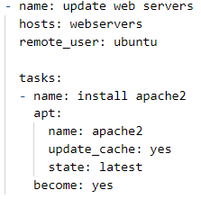

## Intro on Ansible
So first off, what is Ansible? It is an extremely useful tool to automate the process of managing servers at scale. No programming is necessary to learn how to use Ansible, because Ansible has built in modules that will do all the heavy programming for you. All that's needed for Ansible to work is for the control node to have SSH and Python installed. The host machines only need SSH installed, for Ansible to work properly. What's also great is that Ansible works with any operating system such as Linux, Windows, and Mac. Ansible also allows you to run on the fly (ad-hoc) commands and also create playbooks which specify what plays and tasks that you want to accomplish on your host machines. In this blog post, we will go over how to setup a web server on two AWS hosts.

## Installing Ansible on Ubuntu
Run these commands on your Ubuntu machine.
`apt update
apt install software-properties-common
apt-add-repository --yes --update ppa:ansible/ansible
apt install ansible`

## Create EC2 instances for our webservers
1. Login to your AWS account.
2. In your AWS Management Console, go to EC2.
3. Click Launch Instances.
4. Select the Ubuntu 18.04 AMI.
5. Select t2.micro Instance Type.
6. Input 2 under "Number of instances".
7. Skip to "6. Configure Security Group" section.
8. For "SSH" type, select "My IP" as the Source.
9. Click "Add Rule". 
10. For the new rule, click select HTTP as the Type. Then, select "Anywhere" as Source.
11. Then, click Review and Launch.
12. Click "Launch" to create the 2 instances.
13. Make sure to note the Public IPv4 addresses of the 2 instances you just created.

## Adding hosts to the inventory
1. Install nano.
`apt-get install nano`
2. Edit hosts file.
`nano /etc/ansible/hosts`
3. Copy and paste this code into your hosts file. Replace with the appropriate IPv4 address found in your EC2 console. Afterwards, save the file.
`[webservers]
EC2_INSTANCE_1_IPv4_ADDRESS
EC2_INSTANCE_2_IPv4_ADDRESS`

## Creating a playbook to install Apache2
4. Create a new playbook so we can create plays and run tasks.
`nano /etc/ansible/playbook.yml`
5. Write down this code and paste it into playbook.yml.

    
6. Copy your AWS key pair to your Docker container.
`docker cp KEY_PAIR.pem CONTAINER_ID:/etc/ansible`
7. Change the key pair permissions to something more secure.
`chmod 600 KEY_PAIR.pem`
8. Run the playbook with your key pair. 
`ansible-playbook playbook.yml --key-file KEY_PAIR.pem`
9. Once the play completes successfully, you should be able to see the Apache webserver running on both of the AWS instances that we created by checking the Public IPv4 addresses.
