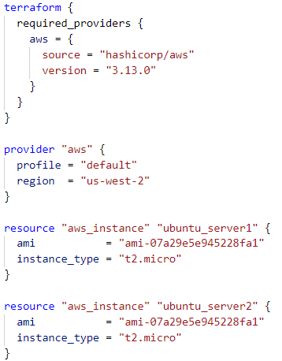

## Intro on Terraform
Let me give you a brief introduction on Terraform and then later on I will give over how to automate the deployment of two Ubuntu AWS servers using Terraform. Terraform is a free and open-source tool that allows you to automate and manage infrastructure such as web servers or database servers with different cloud providers. These providers include the most popular providers such as AWS, Azure, and Google Cloud. The great thing about Terraform is that it is just like Ansible, where it uses a declarative language. You specify your desired end result and Terraform will automatically figure out the steps in between to achieve that end result. Essentially, this allows you to create a blueprint of what you want your infrastructure to be. Another great thing about Terraform is that before your infrastructure is created, it will create an execution plan, which will create a preview of what changes will be made. Next, I'll be going over how to setup the two Ubuntu servers using Terraform.

## Installing Terraform on Ubuntu
1. Add the HashiCorp GPG key.
`curl -fsSL https://apt.releases.hashicorp.com/gpg | sudo apt-key add -`
2. Add the HashiCorp repo.
`sudo apt-add-repository "deb [arch=amd64] https://apt.releases.hashicorp.com $(lsb_release -cs) main"`
3. Update list of packages and install Terraform.
`sudo apt-get update && sudo apt-get install terraform`
4. Verify if terraform was properly installed.
`terraform - help`

## Installing AWS CLI on Ubuntu
AWS CLI is required to make sure Terraform works properly.
1. Download AWS CLI.
`curl "https://awscli.amazonaws.com/awscli-exe-linux-x86_64-2.0.30.zip" -o "awscliv2.zip"`
2. Unzip the installer.
`unzip awscliv2.zip`
3. Install AWS CLI.
`sudo ./aws/install`
4. Verify AWS CLI was installed.
`aws --version`
5. Configure AWS CLI with your AWS Access Key ID and Secret Access Key.
`aws configure`

## Creating the Terraform Configuration
1. Create new directory for our configuration file.
`mkdir FOLDER_NAME_HERE`
2. Change into the newly created directory.
`cd terraform`
3. Create a new file and edit it.
`nano config.tf`
4. Input the below code into the config.tf file.

## Deploying the Infrastructure
5. Initialize the directory where the config.tf file is located.
`terraform init`
6. Format the config file for readability.
`terraform fmt`
7. Generate an execution plan to preview what actions will be taken to create your infrastructure.
`terraform apply`
8. Type "yes" to continue with creating the infrastructure.
9. Congrats! You've now created two Ubuntu servers easily with Terraform! You can check the details of your newly created EC2 instances by running the below command:
`terraform show`