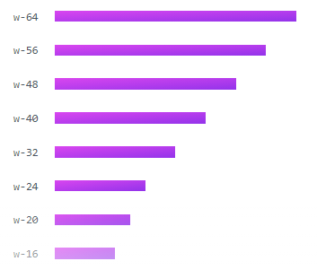

## Tailwind CSS: Rapid Design Framework

Hello all, in today's blog post I will be going over Tailwind which is a CSS framework that allows you to quickly design elements without ever going into your CSS file. That's because all the designing is done using classes within HTML tags. You may have heard of another very popular CSS framework called Bootstrap which relies on components, but the bad thing about Bootstrap is that almost all pages designed with Bootstrap look the same because they all use the same components. But, the best thing about Tailwind is that you can create those same components from scratch so you can truly customize each design element to your liking. Let me show you an example.

## Width Resizing using Tailwind Classes
### Bars created with Tailwind

### HTML Code for the Bars using Tailwind
```
<ul class="space-y-4">
  <li>
    <div class="w-64 h-3 bg-gradient-to-br from-fuchsia-500 to-purple-600"></div>
  </li>
  <li>
    <div class="w-56 h-3 bg-gradient-to-br from-fuchsia-500 to-purple-600"></div>
  </li>
  <li>
    <div class="w-48 h-3 bg-gradient-to-br from-fuchsia-500 to-purple-600"></div>
  </li>
  <li>
    <div class="w-40 h-3 bg-gradient-to-br from-fuchsia-500 to-purple-600"></div>
  </li>
  <li>
    <div class="w-32 h-3 bg-gradient-to-br from-fuchsia-500 to-purple-600"></div>
  </li>
  <li>
    <div class="w-24 h-3 bg-gradient-to-br from-fuchsia-500 to-purple-600"></div>
  </li>
  <li>
    <div class="w-20 h-3 bg-gradient-to-br from-fuchsia-500 to-purple-600"></div>
  </li>
  <li>
    <div class="w-16 h-3 bg-gradient-to-br from-fuchsia-500 to-purple-600"></div>
  </li>
  <li>
    <div class="w-12 h-3 bg-gradient-to-br from-fuchsia-500 to-purple-600"></div>
  </li>
  <li>
    <div class="w-10 h-3 bg-gradient-to-br from-fuchsia-500 to-purple-600"></div>
  </li>
</ul>
```

With Tailwind, you can easily resize the width of a div element by putting a class of "w-48" and this will quickly and easily change the width to 48 pixels. No need to leave your HTML page and go into the CSS file and add a CSS selector and input the width value there.

Tailwind saves a lot of time, so that you can just focus on writing the HTML code instead of the CSS code. Tailwind has tons of elements that it can target such as breakpoints, flexbox, box alignment, spacing, sizing, typography, and backgrounds, just to name a few. With Tailwind, the design possibilities are endless!
